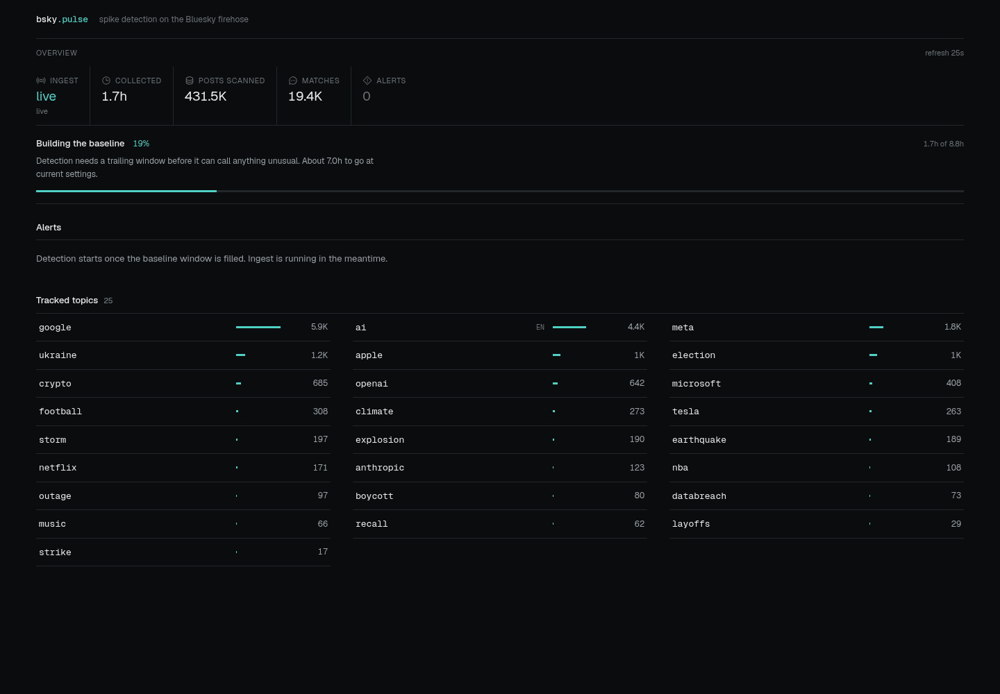
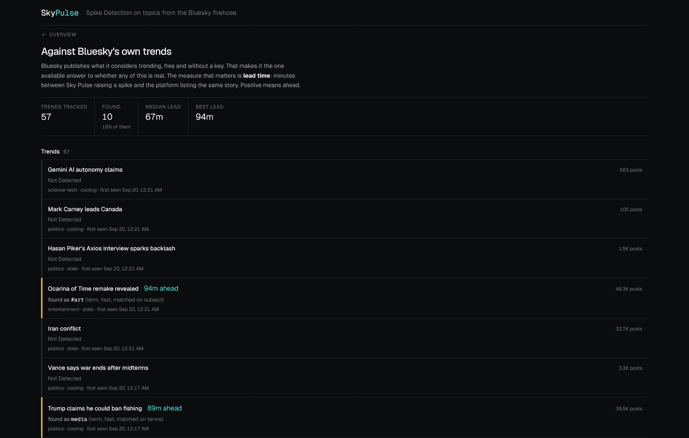

<div align="center">

# sky-pulse

**Spike detection on the Bluesky firehose.**

Finds what people suddenly started talking about — including the things nobody
thought to watch for — and shows you the story behind it.

</div>

<div align="center">
  
</div>

---

## What it does

It watches the live Bluesky firehose and raises an alert when something breaks
meaningfully out of its own normal range. Two things are scored the same way:

- **Watchlist topics** from `backend/topics.json`, matched by regex. Precise,
  and limited to what somebody thought to write down in advance.
- **Discovered terms** — words, pairs and hashtags taken from the stream
  itself. This is what lets a name nobody predicted show up at all.

Terms that spike together in the same posts are grouped into **one story**, not
three findings — and each story carries **the post that said it first**, the
words that made it distinctive, and the links people were sharing. A thousand
people posting at once are usually posting the same story.

One question, answered continuously: **what is suddenly being talked about, and
why?**

## Why it runs for free

Bluesky's Jetstream firehose is open by design. No API key, no developer
portal, no approval queue, no paid tier, and consuming it does not count
against any rate limit. Every other major platform charges, gates, or forbids
this.

Nothing bills per post either. Matching is regex and scoring is median/MAD
arithmetic; the one fitted model runs once per candidate spike, not once per
post, and is a dot product over sixteen numbers. No inference touches the hot
path, and no dependency was added to run it.

## Stack

| Layer | |
|---|---|
| Ingest | Python asyncio, `websockets` |
| Discovery | lossy top-k counting over every post |
| Grouping | co-occurrence graph, Louvain communities, chained over time |
| First story | MinHash + LSH near-duplicate search |
| Confidence | logistic regression, plain Python, no dependency |
| Storage | SQLite (WAL) |
| API | FastAPI |
| Dashboard | Next.js 16, Tailwind v4 |

## Quick start

```bash
make install
make collect   # terminal 1, leave running
make api       # terminal 2
make web       # terminal 3
```

Then open <http://localhost:3000>.

Two more, for a database you already have:

```bash
make detect    # score collected history without streaming
make train     # fit the confidence model from spikes that held or reverted
```

**Windows, or step-by-step instructions: [SETUP.md](SETUP.md).**

> The first alerts arrive about **one hour** in. A spike only means something
> measured against normal, so every horizon needs history behind it before it
> can say anything — but scoring is retroactive, so the deeper horizons fill in
> over the same history once they unlock. Leave the collector running.

## Three horizons

Warm-up is not a property of the method. It is

```
(baseline_window + gap + 1) × bucket_minutes
```

so the bucket size alone decides how soon anything can be scored. Rather than
pick one point on that curve, sky-pulse runs three at once:

| | bucket | baseline | ready after | z | finds |
|---|---|---|---|---|---|
| `fast` | 4 min | 12 buckets | **1 hour** | 5.0 | flash spikes, breaking news |
| `mid` | 8 min | 27 buckets | **4 hours** | 5.0 | developing stories |
| `deep` | 15 min | 33 buckets | **9 hours** | 4.0 | slow builds, steadiest baseline |

Short buckets answer sooner and shout more. Over a real 111-minute capture,
1-minute buckets raised 25.8 alerts/hour at z ≥ 4 where 4-minute buckets raised
3.5, which is why `fast` demands more evidence than `deep` despite seeing less
history: more buckets means more chances to clear the bar by luck.

Scoring is **retroactive** — each pass reads buckets back out of SQLite and
scores all of them — so a horizon that unlocks at hour nine immediately scores
the nine hours already on disk. Nothing collected is wasted, and nothing has to
be recollected after a settings change.

`make detect` scores what you already have without streaming.

## From words to stories

A story does not arrive as one word. `harbour`, `bridge closed` and
`#trafficchaos` spike together because they are the same thing said three ways.
Reporting them separately leaves you to reassemble the story by eye.

So spiking terms are built into a graph — nodes are terms, edges are how often
they appear in the same posts — and its **communities are the events**. That is
the design Twitter runs in production and the one the event-detection
literature settled on. Communities are then **chained across windows**, so a
story that runs for forty minutes is one event forty minutes long rather than
ten separate alerts.

Measured on a 12-hour corpus: **440 term alerts became 88 stories**, 83 of them
spanning more than one window, the longest running nine.

### The post that said it first

For each story, the earliest post that does not resemble anything already being
said is its **first telling** — Petrović, Osborne and Lavrenko's streaming
first story detection, using MinHash signatures and LSH banding so each post is
compared against the few that hash near it rather than against everything.

It is hashing, not inference. No model, no dependency, no per-post cost.

A story whose every post resembles the background gets a novelty of 0, which is
the honest reading: that spike is a continuation, not a beginning.

### Stories that have run before

A show that airs nightly trends nightly. The second time is not news.

Each story's wording is compared against events that finished at least 20 hours
earlier; a close match is flagged as a repeat, with the earlier run named. The
dashboard dims them rather than hiding them — it is a judgement about novelty,
not about correctness.

## Seasonal baselines

Scoring *share* rather than count already removes the network's own daily
rhythm, because the denominator carries it. What it cannot remove is a rhythm
belonging to one subject — a league that plays at eight every evening.

So a bucket is also compared against the same clock time on previous days, once
at least three of them have been collected, and a spike must beat **both**
baselines: unusual against the last hour *and* against this hour on other days.
Taking the larger of the two can only raise the bar, so seasonality removes
false positives without costing a detection.

## The confidence model

A z-score says how far something is from normal. That is not the question a
person has, which is whether it will hold. The two disagree often: a bot flood
can score z = 106 and be gone by the next bucket.

So there is a model, and it is trained on your own data:

- **Label** — did the spike hold? A real story stays elevated for a few
  buckets; a blip is back to baseline immediately. That is visible in the
  buckets after any spike old enough to have them, so **every past spike
  becomes a labelled example three buckets later**. No external service, no
  waiting for anyone's approval.
- **Features** — sixteen values computable at the moment the spike is scored:
  hits, z, multiple, share, coverage, whether the baseline was silent, whether
  the subject is a phrase or a hashtag, how many explanation terms and links it
  had, how established the subject already was, window volume, hour of day. A
  test asserts none of them can see a later bucket, because a feature that
  peeks at the future trains a model that cannot be run live.
- **Model** — logistic regression, ~150 lines of plain Python. No numpy, no
  scikit-learn, nothing added to `requirements.txt`. Inference is a dot product
  per candidate per bucket, not per post, so the zero-cost rule holds.
- **Honesty** — scored on a *chronological* holdout, never a random one:
  several spikes come from the same event, and a random split puts siblings on
  both sides so the score measures memorisation. The dashboard quotes the
  holdout number.

```bash
make train                      # fit from what you have
python run_train.py --dry-run   # how many labels exist, without fitting
```

It refuses below 150 labelled spikes with 20 of each outcome, and says so.
Until then every alert simply carries no confidence, and nothing else changes.

**What it is not:** it learns what *persists*, which is a proxy for what
matters, not the thing itself. When enough confirmed trends have accumulated
from the benchmark below, the same pipeline retrains against those — only the
label changes.

Full details, measured scores and known limitations: **[MODEL_CARD.md](MODEL_CARD.md)**.

## Does it actually work?

Bluesky publishes its own trending list, free and without a key. That makes it
both the competitor and the only available ground truth, so sky-pulse polls it
and scores itself against it.

The measure is **lead time**: minutes between a spike being raised here and the
platform listing the same story. `/benchmark` in the dashboard, or
`GET /api/benchmark`, reports coverage, median lead and best lead. Matching is
deliberately strict — a single common word shared with a headline is a
coincidence, not a detection, so a one-word subject has to be corroborated by
the spike's own explanation before it counts.

Without this there is no way to tune a threshold except by taste.

## How detection works

Six decisions do the real work:

1. **Bucket** minutes into windows. A bucket counts only if the collector ran
   for at least 80% of it, so downtime cannot masquerade as a dip or a spike.
2. **Score share, not count.** A topic's share is its hits divided by all text
   posts in the window. When the network gets busy every raw count rises;
   share does not. This removes the most common false positive.
3. **Baseline from the median** of a trailing window, skipping the buckets just
   before the one being scored so a developing spike stays out of its own
   baseline.
4. **Spread from MAD**, not standard deviation, so one past spike does not
   raise the bar forever — floored by Poisson counting noise, because MAD is
   zero whenever a sparse topic's baseline buckets are all empty, and dividing
   by nothing there ranks silence above every real spike.
5. **Require both** a high z-score and a real number of posts. A 2 to 6 blip on
   a quiet topic never pages anyone.
6. **Explain it** by surfacing the words far more common inside the spike than
   in that subject's usual chatter, and the URLs most shared while it ran. The
   contrast set excludes a guard band either side of the spike: an event that
   runs longer than one bucket spills into its neighbours, and contrasting a
   spike against its own overflow finds nothing.

Two more decisions keep discovery honest:

7. **Count distinct authors, not posts.** One automated account posting the
   same template four hundred times an hour is otherwise indistinguishable
   from a story breaking, and this firehose has several of them.
8. **Keep only the heaviest terms of each minute.** A firehose vocabulary is
   unbounded; a term outside the top of its own minute has nowhere near the
   volume a spike needs, so dropping it costs no recall.

<div align="center">
  
</div>

## Storage, and what it costs

Counters are permanent and tiny. Text is not, so it ages out:

| | kept | why |
|---|---|---|
| minute counters | forever | a few bytes a minute |
| stories | forever | small, and the point of the whole thing |
| topic matches | 14 days | the posts behind a watchlist alert |
| term counts | 48 hours | enough for the deepest baseline |
| sampled posts | 6 hours | explains a term spike; keeping every post is ~1.7 GB/day |

Terms are discovered, not declared, so there is no way to know in advance which
posts will be worth keeping. A fixed fraction of the stream on a short
retention is a few tens of megabytes and still leaves hundreds of posts behind
anything worth reading about.

## Topics

`backend/topics.json` is the watchlist. Discovery does not need it — it is for
subjects you want tracked precisely whether or not they trend. Either form
works:

```jsonc
"earthquake": ["earthquake", "aftershock", "magnitude"],

// language-scoped, for tokens that mean something else elsewhere
"ai": { "phrases": ["ai", "chatgpt", "llm"], "langs": ["en"] }
```

Phrases are literal and case-insensitive, bounded so they cannot match inside a
longer word. The boundary rule also rejects a neighbouring apostrophe, because
plain `\b` treats `'` as a boundary and would match the French `j'ai`. That one
rule removed about 10% of the `ai` topic's matches as noise.

## API

Everything the dashboard does, it does through these. `http://localhost:8000/docs`
is the generated reference.

| | |
|---|---|
| `GET /api/events` | stories, newest first — `mode` |
| `GET /api/events/{mode}/{key}` | one story |
| `POST /api/events/rebuild` | regroup now — `mode` |
| `GET /api/alerts` | individual spikes — `subject`, `mode`, `kind`, `sort` |
| `POST /api/detect` | score history now — `mode`, `kind`, `subject` |
| `GET /api/horizons` | each horizon's warm-up and readiness |
| `GET /api/model` | the confidence model, or null |
| `GET /api/benchmark` | lead time against Bluesky's own trends |
| `GET /api/stats` | corpus size, ingest liveness, horizon status |
| `GET /api/topics` | the watchlist |
| `GET /api/topics/{topic}/series`, `/posts` | one topic over time, and its posts |
| `GET /api/terms/{term}/series`, `/posts` | the same for a discovered term |

Scoring and grouping both run on a timer inside the collector, so `POST`
endpoints are for impatience or for a database nobody is collecting into.

## Layout

```
backend/
  app/
    core/        pure domain logic, detector, spike scoring, model fitting and inference
    db/          every SQL statement in the project
    services/    use cases composed from core + db
    api/         HTTP routes and dependency wiring
    ingest/      jetstream transport, collector orchestration, trend polling
  tests/
    test_core.py      testing core functionalities of the backend
    test_services.py  what only breaks with real SQLite: transactions, migrations
  run_collector.py    stream the firehose
  run_detect.py       score stored history
  run_train.py        fit the confidence model
  data/               pulse.db and model.json
frontend/
  lib/api.ts     the only module that talks to the backend
  components/    presentational only
  app/           pages compose the above
```

Dependencies run one way: `api → services → {core, db}`. Nothing in `core`
imports a layer above it, which is why its tests run in 30ms with no fixtures.

```bash
make test    # 74 tests, ~7s
```

## Notes from building it

- Only about 13% of `app.bsky.feed.post` creates carry text. The rest are reply
  and embed records with an empty `text`. Counting raw events instead of
  text-bearing posts inflates the denominator roughly eightfold.
- Throughput is around 170 post commits per second, about 40 of which have text.
- Ingest liveness is a wall-clock heartbeat, not the newest event's timestamp.
  After a reconnect the stream legitimately runs behind while it catches up, so
  a healthy collector would otherwise report itself as stopped.

## Roadmap

- **Retrain the confidence model on confirmed trends** once enough have
  accumulated from the benchmark, replacing the persistence proxy with the real
  target. Features and serving path are unchanged; only the label moves.
- **Measure the model on live history.** Its published scores are from a
  synthetic corpus and validate the pipeline, not field performance.
- **Unify counting units.** Term hits are distinct authors per minute; topic
  hits are posts per minute. Per-author is the better unit and topics should
  adopt it — they are currently spoofable by one flooding account.
- **Cluster watchlist topics too.** Only discovered terms are grouped today.
  A topic matches phrases that need not appear in its own name, so asking the
  sampled corpus which posts belong to it needs a different join — and a wrong
  join would invent relationships rather than find them.
- **A story-level confidence model.** Events inherit the best confidence among
  their member terms. Scoring the story itself needs story-level labels, which
  only exist once events have run long enough to be judged.
- Notifications and a digest, so a story reaches you without the dashboard
  being open.

## License

[Apache License 2.0](LICENSE).
